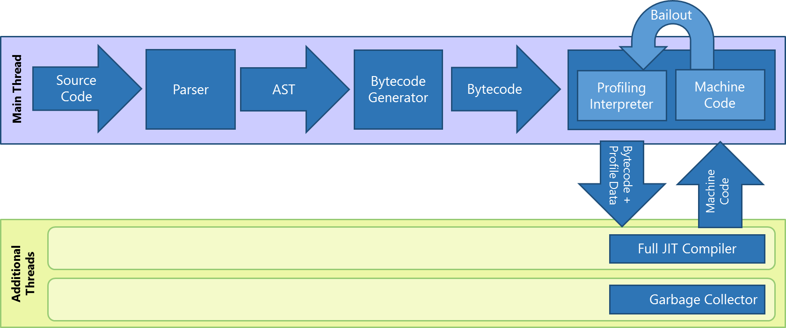

## Introduction

As promised in our [previous blog post][previous-post], we are going to take a look at a method to bypass Microsoft's Control Flow Guard (CFG) when attacking Internet Explorer and Edge browsers. Our previous proof-of-concept exploit worked by ovewriting the function pointer of an object. However, with CFG in place, we cannot simply do that without aborting. We will assume that the adversay has the read-write memory primitive.

__Note__: This post was originally planned to be published back in July, but we decided to submit it for Microsoft's Mitigation Bypass and Bounty Defense Program first. The submission was accepted, and Microsoft asked us to hold off on releasing the details about the technique until it is fixed. Now that it has been a couple months since the patch ([MS16-119][ms16-119]) was deployed, we finally release the details here.


## Background

[Control Flow Guard][cfg] is a fairly recent mitigation on Windows that was added by Microsoft. It is designed to be performant while providing an extra layer of protection by validating the targets of the indirect call/jmps. There are many other references[[1]][trend][[2]][core-sec][[3]][mj] that discuss about CFG in detail, so we won't dive in too deeply here.


While the mitigation makes it harder to perform a control-flow hijacking type of attack, the CFG is inherently not perfect. The technology only protects indirect calls and jumps by design, and thus does not protect the stack (i.e. ROP is still possible). Also, it is worth noting that this is a compile-time instrumentation which requires the source code to be recompiled. Even though many of Microsoft's binaries are now protected with CFG, there are a lot more other programs that aren't compiled with CFG mitigation.


## Chakra JIT

The Chakra JIT is responsible for generating optimized JIT'ed code for functions and loops that are invoked many times. This process is split into multiple stages, with the _Full JIT Compiler_ and _Garbage Collection_ stages occuring in a background thread. An explaination of the pipeline and helpful diagrams can be found on [MSDN][ie11-jit].


<center style="font-size: 0.9em; margin-top:0; color: #666">JIT Pipeline (from MSDN)</center><br>

Our focus is going to be on the _Full JIT Compiler_ which is responsible for ingesting the bytecode and outputting native code. The high-level process for an individual function or loop can be found in [Func::Codegen()][chakra-func]. First, an intermediate representation (IR) of the bytecode is generated. The IR will be transformed several times: optimizations, register allocation, prolog and epilog, etc. Once the IR is ready, it will be encoded into native code by [Encoder::Encode()][chakra-encoder].

```cpp
// https://github.com/Microsoft/ChakraCore/blob/master/lib/Backend/Encoder.cpp#L15

void
Encoder::Encode()
{
    NoRecoverMemoryArenaAllocator localAlloc(_u("BE-Encoder"), m_func->m_alloc->GetPageAllocator(), Js::Throw::OutOfMemory);
    m_tempAlloc = &localAlloc;
...
    m_encodeBuffer = AnewArray(m_tempAlloc, BYTE, m_encodeBufferSize);
...
}
```

The `Encoder` performs the nitty-gritty process of generating the actual native code. First, it will allocate **m_encodeBuffer** which will temporarily contain the native code. After all of the native instructions have been emitted into **m_encodeBuffer**, the `Encoder` applies any relocations to the buffer, copies it to _read-only-execute_ memory, and sets it as a valid call target for CFG. At this point, the temporary buffer is no longer used and can be freed.

```cpp
// https://github.com/Microsoft/ChakraCore/blob/master/lib/Backend/Encoder.cpp#L294

...
    m_encoderMD.ApplyRelocs((size_t) workItem->GetCodeAddress());

    workItem->RecordNativeCode(m_func, m_encodeBuffer);

    m_func->GetScriptContext()->GetThreadContext()->SetValidCallTargetForCFG((PVOID) workItem->GetCodeAddress());
...
```

Note that once the code has been copied to the executable memory, it cannot be easily modified. But, while the `Encoder` was generating the native code in the temporary buffer, there was nothing to prevent an adversary from using a write memory primitive to change the code in the temporary buffer. Since the JIT process is in a background thread, the javascript threads are still running normally. The tricky part for the adversary is finding the temporary buffer and modifying it in the short time that the `Encoder` is running.


## Bypassing CFG

Now that we have a basic method for modifying some JIT code, let's put it into action to bypass CFG.

Our process will have three parts:

1. Trigger the JIT.
2. Find the temporary native code buffer.
3. Modify the contents of the buffer.

There is also an implicit last step of executing the JIT'ed code.

### Trigger JIT

The first step, and the easiest, is to trigger the JIT to start encoding a function. In order to make the second step easier, we want the function's code to be large so that we have enough time to find the temporary buffer in memory. The exact instructions in the function do not matter too much.

```javascript
var code = "var i = 10; var j = 1; ";
for (var i = 0; i < 6000; i++)
{
    code += "i *= i + j.toString();";
}
code += "return i.toString();"

f = Function(code);
for (var i = 0; i < 1000; i++)
{
    // trigger jit
    f.call();
}
```

### Find native code buffer

Once the background thread enters _Encoder::Encode()_, we need to quickly find the temporary native code buffer. One way of finding the buffer is to find the page allocator that was used to allocate it and look through the allocated segments. We noticed that we could find a reference to the page allocator by finding the `ThreadContext` and then the `BackgroundJobProcessor` for the background thread.

```javascript
// find the ThreadContext using ThreadContext::globalListLast
var tctx = readN(jscript9Base + 0x00349034, 4);
// BackgroundJobProcessor
var bgjob = readN(tctx + 0x3b0, 4);
// PageAllocator
var pgalloc = bgjob + 0x1c;
```

The `PageAllocator` has several lists of allocated segments. Since the function that is being JIT'ed is large, the temporary native code buffer will be large as well. We can easily find the segment by looking at the _largeSegments_ list. We can use a while-loop to wait until the _largeSegments_ list is non-empty and then proceed with the last step.

```javascript
while (true) {
    // read largeSegments list
    var largeseg = readN(pgalloc + 0x24, 4);
    // check if the list was empty
    if (largeseg == pgalloc + 0x24) continue;
    // get the address of the actual data
    var page = readN(largeseg + 8 + 8, 4);
    if (page == 0) continue;
    break;
}
```

### Modify and run

Now that we have the location of the temporary native code buffer, we can modify its contents in order to inject our shellcode. While this _should_ be as simple as overwriting the contents of the buffer with our shellcode, it gets complicated because we have to avoid overwriting anything that will be changed in the _relocations_ step. Since the function we used to trigger the JIT calls _toString()_ often, we do not have much space for shellcode while avoiding relocations.

While the best option would be to change the function we are JIT'ing, we instead opted to use a first-stage shellcode that simply calls VirtualProtect and jumps to our second-stage shellcode. This first-stage shellcode is very small (only 20 bytes). We fit it into the buffer by emitting a short jump at the beginning of the buffer to the first-stage which is located at some small offset into the buffer. 

Our second-stage shellcode can now be any length, so in our exploit we use a metasploit-generated shellcode that executes _notepad.exe_. In practice, this second-stage would be responsible for bypassing protected mode (sandbox).

The last step of the process, after we have modified the temporary buffer, is to wait until the JIT'ing process is done and execute the modified JIT code. This can be accomplished by calling the target function until your shellcode executes.

```javascript
for (var i = 0; i < 1000; i++)
{
    // call overwritten jit block
    f.call();
}
```


## Exploit

In order to demonstrate the technique, we adapted the [previous code][previous-code] to target Internet Explorer 11 on Windows 10. The code to achieve a read-write memory primitive hasn't changed, but instead of overwriting a function pointer which will trigger the CFG, we use JIT code overwrite to execute our shellcode.


You can find the final proof-of-concept exploit at [https://github.com/theori-io/jscript9-typedarray-cfg][poc-github].


## Impact

Since the impact of this CFG bypass is limited to situations where the adversary already has a read-write memory primitive, its usefulness may be limited in practice. With that caveat, this bypass has the advantage of being built into the architecture of the Chakra JIT, which means that it may be difficult to patch out and should not be affected by future mitigations such as [Intel's CET][intel-cet].


## Patch

Microsoft has [committed][patch] the changes in ChakraCore in trying to mitigate the CFG bypass we found (along with other CVE patches). The basic idea is to compute the *checksum* as the encoder encodes the instructions, and validate the checksum after copying the entire buffer to the final RX (read/execute-only) buffer. And, only when it's validated the entry point of JIT'ed code as a valid CFG target. The choice of the checksum algorithm here was CRC32.

We appreciate Microsoft's willingness to offer bug bounties for mitigation bypasses and quick response time. We hope that this post will inspire others to continue to research new ways to bypass current mitigations and develop new mitigations.

[patch]: https://github.com/Microsoft/ChakraCore/commit/097edcd2e452e423b5f83b64b47f6bb7f5cd520d#diff-d30731d63f273a741e4944781d64e709
[ms16-119]: https://technet.microsoft.com/library/security/MS16-119
[trend]: http://blog.trendmicro.com/trendlabs-security-intelligence/exploring-control-flow-guard-in-windows-10/
[mj]: http://www.powerofcommunity.net/poc2014/mj0011.pdf
[core-sec]: https://blog.coresecurity.com/2015/03/25/exploiting-cve-2015-0311-part-ii-bypassing-control-flow-guard-on-windows-8-1-update-3/
[previous-post]: http://theori.io/research/jscript9_typed_array
[previous-code]: https://github.com/theori-io/jscript9-typedarray
[poc-github]: https://github.com/theori-io/jscript9-typedarray-cfg
[cfg]: https://msdn.microsoft.com/en-us/library/windows/desktop/mt637065%28v=vs.85%29.aspx?f=255&MSPPError=-2147217396
[ie11-jit]: https://blogs.msdn.microsoft.com/ie/2014/10/09/announcing-key-advances-to-javascript-performance-in-windows-10-technical-preview/
[chakra-encoder]: https://github.com/Microsoft/ChakraCore/blob/master/lib/Backend/Encoder.cpp
[chakra-func]: https://github.com/Microsoft/ChakraCore/blob/master/lib/Backend/Func.cpp#L243
[chakra-tc]: https://github.com/Microsoft/ChakraCore/blob/master/lib/Runtime/Base/ThreadContext.h
[chakra-alloc]: https://github.com/Microsoft/ChakraCore/blob/master/lib/Common/Memory/PageAllocator.h
[intel-cet]: https://software.intel.com/sites/default/files/managed/4d/2a/control-flow-enforcement-technology-preview.pdf
